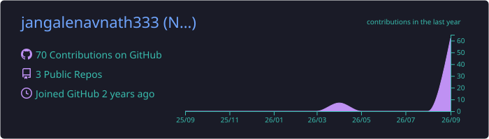
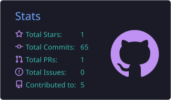
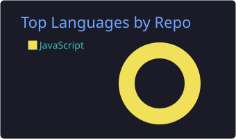
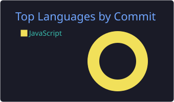

<!-- ============ HEADER ============ -->
<p align="center">
  
</p>

<p align="center">
  <a href="https://git.io/typing-svg">
    
  </a>
</p>

<p align="center">
  <a href="https://github.com/jangalenavnath333"></a>
  <a href="https://newarts-casas-pgcet.in"></a>
</p>

---

<!-- ============ ABOUT ============ -->
<table>
<tr>
<td width="58%" valign="top">

### 👨‍💻 About Me

I'm an **M.Sc. Computer Science** student at **New Arts, Commerce & Science College (Autonomous), Ahilyanagar**, and I ship production software, not just college projects.

- 🎓 Built my college's **live CET Online Admission Exam Portal**, used by real applicants every admission season
- 💼 Deliver **freelance software** for local businesses: transport management, GST e-way bill automation
- 🏢 Former intern at **AvinyaEdge Innovations**
- 🤝 Member of the **CASAS Developer Club**
- 🌱 Currently going deep into **Next.js**

</td>
<td width="42%" valign="top">

### ⚡ Quick Facts

```js
const navnath = {
  location:  "Ahilyanagar, MH 🇮🇳",
  focus:     "Full Stack Web Apps",
  stack:     ["React", "Next.js", "Supabase"],
  shipped:   "Live exam portal + client SaaS",
  languages: ["Marathi", "Hindi", "English"],
  motto:     "Build → Ship → Improve"
};
```

</td>
</tr>
</table>

---

<!-- ============ TECH STACK ============ -->
### 🛠️ Tech Stack

<p align="center">
  <br/><br/>
  <br/><br/>
  
</p>

---

<!-- ============ PROJECTS ============ -->
### 🚀 Featured Projects

<table>
<tr>
<td width="50%" valign="top">

#### 🎓 CET Online Admission Portal
Entrance exam + admission system for PG courses, **running in production** at my college.

  

🔗 **[newarts-casas-pgcet.in](https://newarts-casas-pgcet.in)**

</td>
<td width="50%" valign="top">

#### 🚚 Sapna Transport TMS
Transport management software built for a real client: trips, billing and records in one place.

  

🔗 **[sapna-tms.vercel.app](https://sapna-tms.vercel.app)**

</td>
</tr>
<tr>
<td width="50%" valign="top">

#### 🏥 HealthTrack Ahilyanagar
PHC → District Hospital health network with unique patient IDs and a live disease map. *(Avishkar research project)*

  

</td>
<td width="50%" valign="top">

#### 🌾 ShetMitra (शेतमित्र)
Marathi-language chatbot giving practical farming advice to farmers.

  

</td>
</tr>
<tr>
<td width="50%" valign="top">

#### 🧾 E-Way Bill Automation *(in progress)*
Auto-generates GST e-way bills through the NIC portal for a business client.

 

</td>
<td width="50%" valign="top">

#### 💬 Shivrakshak WhatsApp API
WhatsApp messaging automation through API integration.

 

🔗 **[Repository](https://github.com/jangalenavnath333/shivrakshak-whatsapp-api)**

</td>
</tr>
</table>

> 🔒 Several client and institutional projects live in private repositories. Demos available on request.

---

<!-- ============ STATS ============ -->
### 📊 GitHub Activity

<p align="center">
  
</p>

<p align="center">
  
  
</p>

<p align="center">
  
  
</p>

<!-- Snake animation -->
<p align="center">
  <picture>
    <source media="(prefers-color-scheme: dark)" srcset="https://raw.githubusercontent.com/jangalenavnath333/jangalenavnath333/output/github-snake-dark.svg" />
    
  </picture>
</p>

---

<p align="center">
  <b>Open to internships, freelance projects and full-time roles.</b><br/>
  Let's build something useful together 🤝
</p>

<p align="center">
  
</p>
